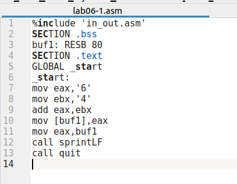
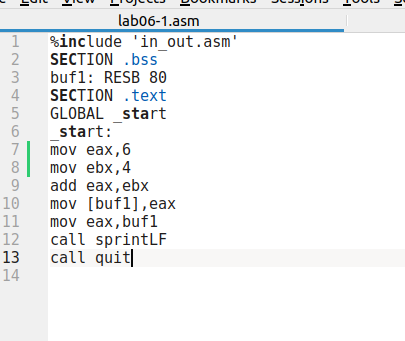
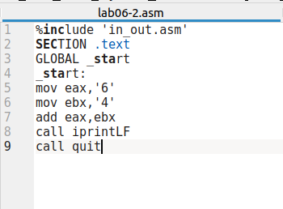
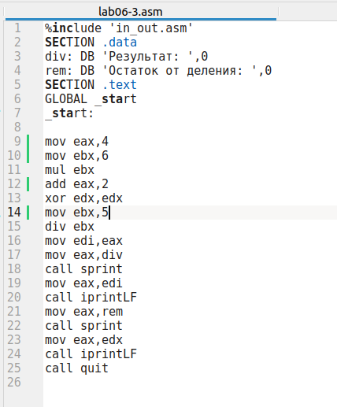
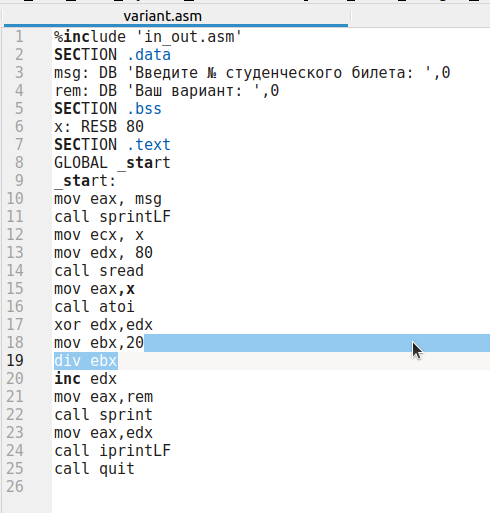
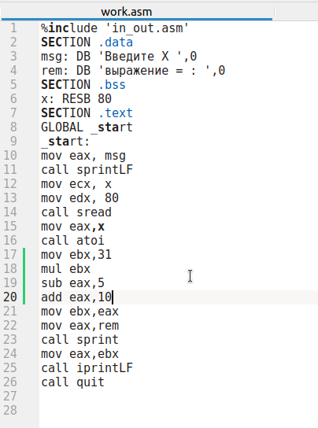

---
## Front matter
title: "Отчёт по лабораторной работе 6"
subtitle: "дисциплина:	Архитектура компьютера"
author: "Бельчуг Александр Константинович"

## Generic otions
lang: ru-RU
toc-title: "Содержание"

## Bibliography
bibliography: bib/cite.bib
csl: pandoc/csl/gost-r-7-0-5-2008-numeric.csl

## Pdf output format
toc: true # Table of contents
toc-depth: 2
lof: true # List of figures
lot: true # List of tables
fontsize: 12pt
linestretch: 1.5
papersize: a4
documentclass: scrreprt
## I18n polyglossia
polyglossia-lang:
  name: russian
  options:
	- spelling=modern
	- babelshorthands=true
polyglossia-otherlangs:
  name: english
## I18n babel
babel-lang: russian
babel-otherlangs: english
## Fonts
mainfont: PT Serif
romanfont: PT Serif
sansfont: PT Sans
monofont: PT Mono
mainfontoptions: Ligatures=TeX
romanfontoptions: Ligatures=TeX
sansfontoptions: Ligatures=TeX,Scale=MatchLowercase
monofontoptions: Scale=MatchLowercase,Scale=0.9
## Biblatex
biblatex: true
biblio-style: "gost-numeric"
biblatexoptions:
  - parentracker=true
  - backend=biber
  - hyperref=auto
  - language=auto
  - autolang=other*
  - citestyle=gost-numeric
## Pandoc-crossref LaTeX customization
figureTitle: "Рис."
tableTitle: "Таблица"
listingTitle: "Листинг"
lofTitle: "Список иллюстраций"
lotTitle: "Список таблиц"
lolTitle: "Листинги"
## Misc options
indent: true
header-includes:
  - \usepackage{indentfirst}
  - \usepackage{float} # keep figures where there are in the text
  - \floatplacement{figure}{H} # keep figures where there are in the text
---

# Цель работы

Целью работы является освоение арифметических инструкций языка ассемблера NASM.

# Выполнение лабораторной работы

## Символьные и численные данные в NASM

Я создал каталог для программ лабораторной работы № 6, перешел в него и создал файл lab6-1.asm.

В этом разделе рассмотрим примеры программ, которые выводят символьные и численные значения. Программы будут выводить данные, записанные в регистр eax.

В данной программе в регистр eax записывается символ '6' (с помощью команды mov eax, '6'), в регистр ebx записывается символ '4' (с помощью команды mov ebx, '4'). Затем к значению в регистре eax прибавляется значение из регистра ebx (командой add eax, ebx), и результат сохраняется в eax. После этого выводим результат. 

Так как для работы функции sprintLF в регистр eax должен быть записан адрес, создаем дополнительную переменную. Сначала записываем значение из регистра eax в переменную buf1 (команда mov [buf1], eax), затем записываем адрес этой переменной в регистр eax (команда mov eax, buf1) и вызываем функцию sprintLF.

{ #fig:001 width=70%, height=70% }

{ #fig:002 width=70%, height=70% }

При выводе значения из регистра eax мы ожидали увидеть число 10, но на самом деле вывелся символ 'j'. Это связано с тем, что код символа '6' равен 00110110 (54 в десятичной системе), а код символа '4' — 00110100 (52). Когда эти значения сложились (с помощью команды add eax, ebx), результатом стало значение 106, что в свою очередь соответствует символу 'j' в таблице ASCII.

Затем я изменил программу, заменив символы на числа. 

{ #fig:003 width=70%, height=70% }

{ #fig:004 width=70%, height=70% }

Как и в предыдущем примере, при исполнении программы мы не получим число 10, а на экране появится символ с кодом 10, который представляет собой символ конца строки (возврат каретки). В консоли он не отображается, но добавляет новую строку.

Для работы с числами в файле in_out.asm предусмотрены подпрограммы для преобразования символов в числа и наоборот. Я преобразовал программу, используя эти функции.

{ #fig:005 width=70%, height=70% }

{ #fig:006 width=70%, height=70% }

Результатом выполнения программы стало число 106. Здесь, как и в предыдущем примере, команда add складывает коды символов '6' и '4' (54 + 52 = 106). Однако теперь функция iprintLF позволяет вывести это число, а не символ, код которого равен 106.

Заменил символы на числа, и результат вывода — число 10, так как функции выводят именно числовые значения.

{ #fig:007 width=70%, height=70% }

{ #fig:008 width=70%, height=70% }

Позже заменил функцию iprintLF на iprint. Создал исполняемый файл и запустил его. Результат отличается тем, что теперь выводится значение без переноса строки.

{ #fig:009 width=70%, height=70% }

## Выполнение арифметических операций в NASM

Теперь рассмотрим пример программы, которая выполняет арифметические операции, используя выражение $ f(x) = (5 * 2 + 3)/3 $. 

{ #fig:010 width=70%, height=70% }

{ #fig:011 width=70%, height=70% }

Я изменил программу для вычисления выражения $ f(x) = (4 * 6 + 2)/5 $, создал исполняемый файл и проверил его работу.

{ #fig:012 width=70%, height=70% }

{ #fig:013 width=70%, height=70% }

Еще один пример — программа для вычисления варианта задания, используя номер студенческого билета.

В этом случае значение для вычислений вводится с клавиатуры. Как я уже упоминал, ввод данных осуществляется в символьной форме, и для правильной работы арифметических операций необходимо преобразовать символы в числа. Для этого используется функция atoi из файла in_out.asm.

{ #fig:014 width=70%, height=70% }

{ #fig:015 width=70%, height=70% }

## Ответы на вопросы

1. Какие строки листинга отвечают за вывод на экран сообщения ‘Ваш вариант:’?
   - Инструкция mov eax, rem переносит значение переменной с фразой ‘Ваш вариант:’ в регистр eax.
   - Инструкция call sprint вызывает подпрограмму для вывода строки.

2. Для чего используются следующие инструкции?
   - Инструкция mov ecx, x — для помещения значения переменной x в регистр ecx.
   - Инструкция mov edx, 80 — для помещения значения 80 в регистр edx.
   - Инструкция call sread — для вызова подпрограммы для считывания значения студенческого билета.

3. Для чего используется инструкция “call atoi”?
   - Инструкция “call atoi” используется для преобразования введенных символов в числовой формат.

4. Какие строки листинга отвечают за вычисления варианта?
   - Инструкция xor edx, edx обнуляет регистр edx.
   - Инструкция mov ebx, 20 записывает значение 20 в регистр ebx.
   - Инструкция div ebx выполняет деление номера студенческого билета на 20.
   - Инструкция inc edx увеличивает значение регистра edx на 1.

   В данном случае происходит деление номера студенческого билета на 20. Остаток от деления сохраняется в регистре edx, и к нему прибавляется 1.

5. В какой регистр записывается остаток от деления при выполнении инструкции “div ebx”?
   - Остаток от деления записывается в регистр edx.

6. Для чего используется инструкция “inc edx”?
   - Инструкция “inc edx” увеличивает значение в регистре edx на 1, что необходимо для вычисления варианта.

7. Какие строки листинга отвечают за вывод на экран результата вычислений?
   - Инструкция mov eax, edx записывает результат вычислений в регистр eax.
   - Инструкция call iprintLF вызывает подпрограмму для вывода результата на экран.

## Задание для самостоятельной работы

Написал программу для вычисления выражения $ y = f(x) $. Программа должна выводить выражение для вычисления, запросить ввод значения x, вычислить выражение в зависимости от введенного x и вывести результат. В функцию $ f(x) $ выбрал вариант из таблицы 6.3 в соответствии с номером, полученным в лабораторной работе. Создал исполняемый файл и проверил его работу для значений x1 и x2.

Получил вариант 9: $ f(x) = 10 + (31x - 5) $ для $ x=3 $ и $ x=1 $.

При $ x=3 $ результат — 98.

При $ x=1 $ результат — 36.

{ #fig:016 width=70%, height=70% }

{ #fig:017 width=70%, height=70% }

Программа работает корректно.

# Выводы

Изучили работу с арифметическими операциями.